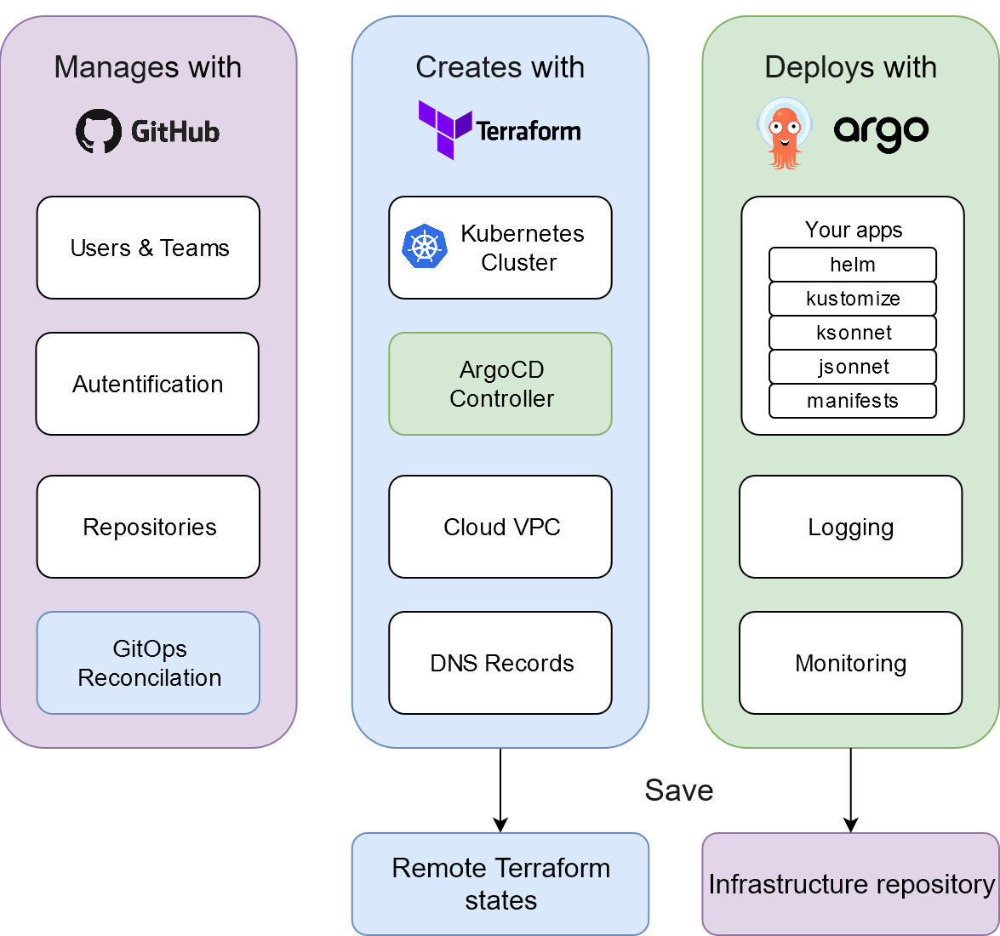

# Cluster.dev - Kubernetes-based Dev Environment in Minutes


<p align="center">
    <a href="https://cluster-dev.slack.com/join/shared_invite/zt-dhculpgn-EccDBxR8i7w65WCGNR1OEA" alt="Join Slack">
        </a>
    <a href="https://github.com/shalb/cluster.dev/graphs/contributors" alt="Contributors">
        </a>
    <a href="https://github.com/shalb/cluster.dev/pulse" alt="Activity">
        </a>
    <a href="https://twitter.com/intent/follow?screen_name=shalbcom">
        </a>
</p>

Cluster.dev is an open-source system delivered as GitHub Action or Docker Image for creating and managing Kubernetes clusters with simple manifests by GitOps approach.

Designed for developers that don't want waste time to configure Kubernetes stuff and just need: kubeconfig, dashboard, logging, monitoring and deployment systems out-of-the-box.

GitOps infrastructure management with Terraform and continuous deployment with ArgoCD. Easily extendable by pre-configured applications and modules. Quick integration with Jenkins, GitLab or  other CI/CD systems. Supports multiple Cloud Providers and Kubernetes versions.

----

## MENU

* [Principle diagram](#principle-diagram-)
* [How it works](#how-it-works-)
* [Configuration options](/docs/OPTIONS.md)
* [Installation](#installation-)
  * [Quick Start on AWS](#quick-start-on-aws-)
  * [Cleanup](#cleanup-)
* [Technical diagram](#technical-diagram-)
* [Roadmap](#roadmap-)
* [Contributing](#contributing-)
* [FAQ](#faq-)

----


## Principle diagram [`↑`](#menu)

Small and understandable yaml definition:

```yaml
cluster:
  installed: true
  name: develop
  cloud:
    provider: aws
    region: eu-central-1
    vpc: default
    domain: cluster.dev
    provisioner:
      type: minikube
      instanceType: m5.large
  modules:
    nginx-ingress: true
    cert-manager: true
  apps:
    - /kubernetes/apps/samples
```

`cluster.dev` turns into powerful ready to use infrastructure in code:



## How it works [`↑`](#menu)

In background:

* Terraform creates a "state bucket" in your Cloud Provider account where all infrastructure objects will be stored. Typically it is defined on Cloud Object Storage like AWS S3.
* Terraform modules create Minikube/EKS/GKE/etc.. cluster, VPC and DNS zone within your Cloud Provider.
* ArgoCD Continuous Deployment system is deployed inside Kubernetes cluster. It enables you to deploy your applications from raw manifests, helm charts or kustomize yaml's.
* GitHub CI runner is deployed into your Kubernetes cluster and used for your apps building CI pipelines with GitHub Actions.

You receive:

* Automatically generated kubeconfig, ssh-access, and ArgoCD UI URLs
* Configured: Ingress Load Balancers, Kubernetes Dashboard, Logging(ELK), Monitoring(Prometheus/Grafana)


## Installation [`↑`](#menu)

### Quick Start on AWS [`↑`](#menu)

_normally it takes 15 minutes_

1. Create a separate repository for the infrastructure code that will be managed by `cluster.dev`in GitHub.  
This repo will host code for your clusters, deployments, applications and other resources.  
Clone the repo locally:

    ```bash
    $ git clone https://github.com/YOUR-USERNAME/YOUR-REPOSITORY
    $ cd YOUR-REPOSITORY
    ```

**Next steps** should be done inside that repo.

2. Create new AWS user with limited access in IAM.  
Watch [video example](https://www.youtube.com/watch?v=ALF1Ku2lYys) to create user and apply [policy](install/aws_policy.json).  
If you need more information about AWS users - please check [aws documentation](https://docs.aws.amazon.com/IAM/latest/UserGuide/id_users_create.html#id_users_create_console) for details.  

    Resulting access pair should look like:

    ```yaml
    AWS_ACCESS_KEY_ID = ATIAAJSXDBUVOQ4JR
    AWS_SECRET_ACCESS_KEY = SuperAwsSecret
    ```


3. Add credentials to you repo Secrets under GitHub's repo setting: `Settings → Secrets`:  

    

4. In your repo, create a Github Workflow file: [.github/workflows/main.yml](.github/workflows/main.yml) and  
 cluster.dev example manifest: [.cluster.dev/aws-minikube.yaml](.cluster.dev/aws-minikube.yaml) with cluster definition.

    _Or download example files to your local repo clone using the next commands:_


    ```bash
    # Sample with Minikube cluster
    export RELEASE=v0.1.6
    mkdir -p .github/workflows/ && wget -O .github/workflows/main.yml "https://raw.githubusercontent.com/shalb/cluster.dev/${RELEASE}/.github/workflows/aws.yml"
    mkdir -p .cluster.dev/ && wget -O .cluster.dev/aws-minikube.yaml "https://raw.githubusercontent.com/shalb/cluster.dev/${RELEASE}/.cluster.dev/aws-minikube.yaml"
    ```

5. In cluster definition yaml (.cluster.dev/aws-minikube.yaml) you should set your own Route53 DNS zone. If you don't have any hosted public zone you can create it manually with [instructions from AWS Website](https://docs.aws.amazon.com/Route53/latest/DeveloperGuide/CreatingHostedZone.html).

6. You can change all other parameters or leave default values in cluster.yaml.  
Leave github workflow file as is.

7. Copy sample ArgoCD applications from [/kubernetes/apps/samples](https://github.com/shalb/cluster.dev/tree/master/kubernetes/apps/samples) and Helm chart samples from [/kubernetes/charts/wordpress](https://github.com/shalb/cluster.dev/tree/master/kubernetes/charts/wordpress) to the same paths into your repo.

    _Or download application samples directly to local repo clone with commands:_

    ```bash
    export RELEASE=v0.1.6
    # Create directory and place ArgoCD applications inside
    mkdir -p kubernetes/apps/samples && wget -O kubernetes/apps/samples/helm-all-in-app.yaml "https://raw.githubusercontent.com/shalb/cluster.dev/${RELEASE}/kubernetes/apps/samples/helm-all-in-app.yaml"
    wget -O kubernetes/apps/samples/helm-dependency.yaml "https://raw.githubusercontent.com/shalb/cluster.dev/${RELEASE}/kubernetes/apps/samples/helm-dependency.yaml"
    wget -O kubernetes/apps/samples/raw-manifest.yaml "https://raw.githubusercontent.com/shalb/cluster.dev/${RELEASE}/kubernetes/apps/samples/raw-manifest.yaml"
    # Download sample chart which with own values.yaml
    mkdir -p kubernetes/charts/wordpress && wget -O kubernetes/charts/wordpress/Chart.yaml "https://raw.githubusercontent.com/shalb/cluster.dev/${RELEASE}/kubernetes/charts/wordpress/Chart.yaml"
    wget -O kubernetes/charts/wordpress/requirements.yaml "https://raw.githubusercontent.com/shalb/cluster.dev/${RELEASE}/kubernetes/charts/wordpress/requirements.yaml"
    wget -O kubernetes/charts/wordpress/values.yaml "https://raw.githubusercontent.com/shalb/cluster.dev/${RELEASE}/kubernetes/charts/wordpress/values.yaml"
    ```

    Define path to ArgoCD apps in cluster manifest:

    ```yaml
      apps:
        - /kubernetes/apps/samples
    ```

8. Commit and Push files to your repo and follow the Github Action execution status.  
In GitHub action output you'll receive access instructions to your cluster and services:  


9. Voilà! You receive GitOps managed infrastructure in code. So now you can deploy applications, create more clusters, integrate with CI systems, experiment with the new features and everything from Git don't leaving your IDE.

### Cleanup [`↑`](#menu)

For shutdown cluster and remove all associated resources:

1. Open `.cluster.dev/` directory in your repo.
2. In each manifest set `cluster.installed` to `false`
3. Commit and push changes
4. Open Github Action output for see removal status

After successful removal, you can safely delete cluster manifest file from `.cluster.dev/` directory.


## Technical diagram [`↑`](#menu)


## Roadmap [`↑`](#menu)

The project is in Alpha Stage. Roadmap details: [docs/ROADMAP.md](docs/ROADMAP.md)

## Contributing [`↑`](#menu)

If you want to spread the project with your own code, you could start contributing with this quick guide: [docs/CONTRIBUTING.md](docs/CONTRIBUTING.md)

## FAQ [`↑`](#menu)

* [Available log levels and how it change](https://github.com/shalb/cluster.dev/blob/master/docs/bash-logging.md#logging-levels)
