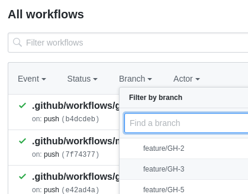

# Contributing

If you plan to make some changes, please have a look at our [style guide requirements](style-guide.md) first.

If you want to add another Cloud Provider or Kubernetes Provisioner, please see [add-provider-provisioner.md](add-provider-provisioner.md).

## How to contribute

1) Create an issue that you are going to address in [GH Issues](https://github.com/shalb/cluster.dev/issues), for example issue `#3`.

2) Spawn new branch from master named with the GH Issue you are going to address: `feature/GH-3`. For preferable branch naming format [see here](https://github.com/pdffiller/styleguide-hooks/#branch-naming-format).

3) To start a new cluster corresponding to your issue, create a manifest file in `.cluster.dev/gh-3.yaml`, setting the name with the target issue:

```yaml
installed: true
name: gh-3 #CHANGE ME
provider:
  type: aws
  region: eu-central-1
  availability_zones:
    - eu-central-1b
    - eu-central-1c
  vpc: default
  domain: cluster.dev
  provisioner:
    type: minikube
    instanceType: m5.large
addons:
  nginx-ingress: true
  cert-manager: true
apps:
  - /kubernetes/apps/samples

```

4) Create a new workflow in `.github/workflows` and name it corresponding to your issue: `gh-3.yaml`. Set the required branch and file name in placeholders (marked with `#CHANGE ME`), for example:

```yaml
on:
  push:
      branches:
        - feature/GH-3 #CHANGE ME
jobs:
  deploy_cluster_job:
    runs-on: ubuntu-latest
    name: Deploy and Update K8s Clusters
    steps:
    - name: Checkout Repo
      uses: actions/checkout@v2
      with:
        ref: 'feature/GH-3' #CHANGE ME
    - name: Reconcile Clusters
      id: reconcile
      uses: shalb/cluster.dev@v0.3.3 #CHANGE ME
      env:
        AWS_ACCESS_KEY_ID: "${{ secrets.AWS_ACCESS_KEY_ID }}"
        AWS_SECRET_ACCESS_KEY: "${{ secrets.AWS_SECRET_ACCESS_KEY }}"
        CLUSTER_CONFIG_PATH: "./.cluster.dev/"
        VERBOSE_LVL: DEBUG
```

5) Commit and push both files with the comment, for example: `GH-3 Initial Commit`. GitHub automatically [creates reference](https://help.github.com/en/github/writing-on-github/autolinked-references-and-urls#issues-and-pull-requests) to the related issue to let other contributors know that related work has been addressed somewhere else.

6) Check the logs in [GH Actions](https://github.com/shalb/cluster.dev/actions) to track the environment building process. To do this, choose your branch in the workflows section and choose your last build:
  

7) Check the cluster status with your target cloud provider.

8) After you have made all the necessary changes, open a Pull Request and assign it to [@voatsap](https://github.com/voatsap) or [@MaxymVlasov](https://github.com/MaxymVlasov) for the review.

9) After successful review, squash and merge your PR to master with the included comment `Resolve GH-3`.

10) After merging be sure to delete all the resources associated with the issue (EC2 instances, Elastic IP's etc.) that have been used for testing.
