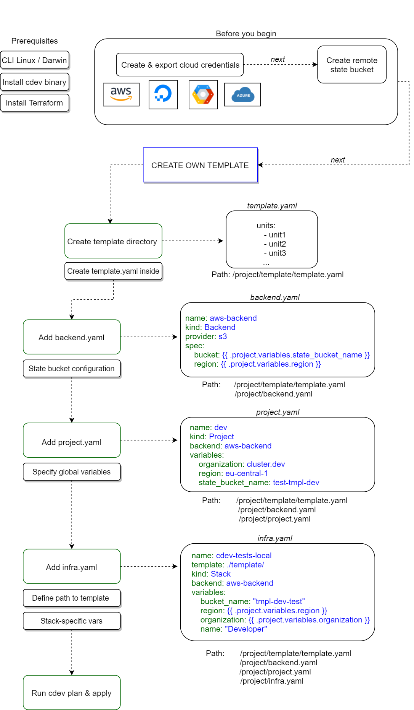

# Create Own Template

Cluster.dev enables you to [create your own stack templates](https://docs.cluster.dev/how-does-cdev-work/#create-your-own-stack-template).  

The diagram below illustrates the whole process step by step, starting from preliminaries and up to deploying your stack with `cdev apply` command. 

## Workflow diagram 

