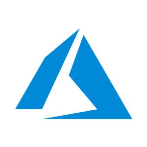

# Cluster.dev Examples Overview

## Working with Terraform Modules

Example of how to create a static website hosting on different clouds:

| Cloud Provider | Sample Link                               | Technology Image |
|----------------|-------------------------------------------|------------------|
| AWS            | [Quick Start on AWS](https://docs.cluster.dev/get-started-cdev-aws/)                   |   |
| Azure          | [Quick Start on Azure](https://docs.cluster.dev/get-started-cdev-azure/)                 |   |
| GCP            | [Quick Start on GCP](https://docs.cluster.dev/get-started-cdev-gcp/)                   |   |

## Kubernetes Deployment with Helm Charts

Example of how to deploy application with Helm and Terraform to Kubernetes:

| Description                 | Sample Link                           | Technology Image |
|-----------------------------|---------------------------------------|------------------|
| Kubernetes Terraform Helm | [Quick Start with Kubernetes](https://docs.cluster.dev/get-started-cdev-helm/)    |    |

## Bootstrapping Kubernetes in Different Clouds

Create fully featured Kubernetes clusters with required addons:

| Cloud Provider | Kubernetes Type | Sample Link             | Technology Image |
|----------------|-----------------|-------------------------|------------------|
| AWS            | EKS             | [AWS-EKS](https://docs.cluster.dev/examples-aws-eks/)            |   |
| AWS            | K3s             | [AWS-K3s](https://docs.cluster.dev/examples-aws-k3s/)            |   |
| GCP            | GKE             | [GCP-GKE](https://docs.cluster.dev/examples-gcp-gke/)            |   |
| AWS            | K3s + Prometheus| [AWS-K3s Prometheus](https://docs.cluster.dev/examples-aws-k3s-prometheus/) |    |
| DO             | K8s             | [DO-K8s](https://docs.cluster.dev/examples-do-k8s/)             |   |

