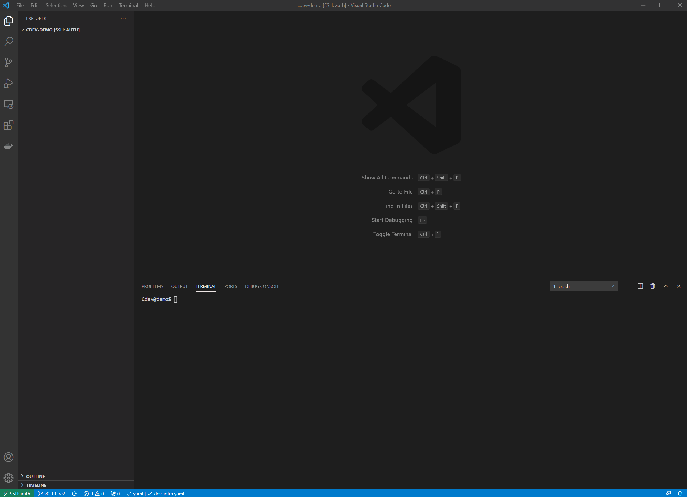

# Cluster.dev - Cloud Infrastructures' Management Tool

## What is it?

Cluster.dev is an open-source tool designed to manage Cloud Native Infrastructures with simple declarative manifests - infrastructure templates. It allows you to describe a whole infrastructure and deploy it with a single tool.

The infrastructure templates could be based on Terraform modules, Kubernetes manifests, Shell scripts, Helm charts, Kustomize and ArgoCD/Flux applications, OPA policies etc. Cluster.dev sticks those components together so that you could deploy, test and distribute a whole set of components with pinned versions.

## Quick Preview

## How does it work?

With cluster.dev you create or download a predefined template, set the variables, then render and deploy a whole infra set.

Capabilities:

- Re-using all existing Terraform private and public modules and Helm Charts.
- Applying parallel changes in multiple infrastructures concurrently.
- Using the same global variables and secrets across different infrastructures, clouds and technologies.
- Templating anything with Go-template function, even Terraform modules in Helm style templates.
- Create and manage secrets with sops or cloud secret storages.
- Generate a ready to use Terraform code.

## Features

- Based on DevOps and SRE best-practices.
- Simple CI/CD integration.
- GitOps cluster management and application delivery.
- Automated provisioning of Kubernetes clusters in AWS, Azure, DO and GCE.
