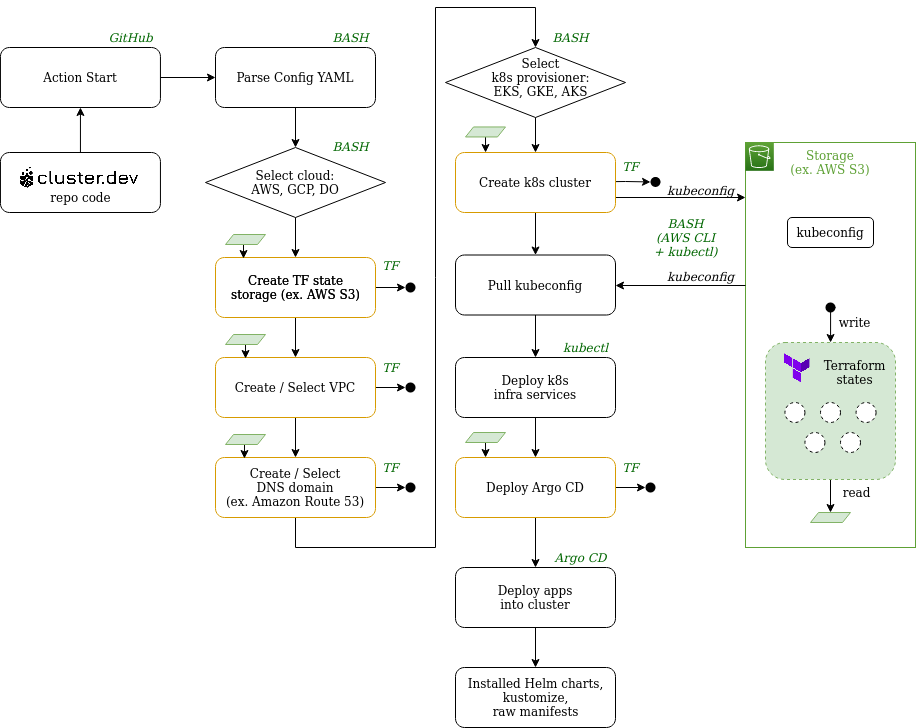

# Hashicorp Users Group Meetup #10

## Cluster.dev - Why we Build own Bicycle with Terraform and Kuberentes?

### About Me

**Volodymyr Tsap**, 34  
Kyiv, Ukraine  
CTO @ [SHALB.com](https://www.shalb.com)

Love: urban tourism, tech, football, electronic music.

17 years of work experience in infrastructure management.  

 
 
 
 
 
 
 
 
 
 
 
 
 
 
 
 
 
 
 
 

### About Company

**S**ecurity **H**igh **A**vailability **L**oad **B**alancing  

DevOPS as a Service Company  

Team - 15 happy SHALB'ers.  

We have built more than **100 production** infrastructures in last **11 years**.

Customers in Ukraine: Ajax, Hotline, Concert.ua, Health24, Horoshop, Payop etc.

 
 
 
 
 
 
 
 
 
 
 
 
 
 
 
 
 
 
 
 

### Company Specializations Vectors

	- Architectural Consulting
	- Infrastructure as a Code (IaC)
	- CI/CD
	- Monitoring
	- Support 24x7
	- Databases
	- Security

 
 
 
 
 
 
 
 
 
 
 
 
 
 
 
 
 
 
 
 

### Common Modern Infrastructure

- Code Hosting: Github, Gitlab, Bitbucket

- Cloud Provider: AWS, Azure, GCP, DO

- IaC: Terraform, Bash, Ansible

- Workload executors:
  Instances, Docker, Kubernetes, Lambda's, Knative/DAGs

- Databases and Queues:
  MySQL, PostgreSQL, MongoDB, ElasticSearch, Redis, Kafka, Rabbit

- CI/CD:
  Jenkins/-X, Gitlab, GitHub, CircleCI, Argo/CD, FluxCD

- Observability:
  Elastic EFK, Prometheus, Grafana, Jaeger, OpsGenie/Pagerduty

- Users and auth Providers:
  OIDC/OAuth, IAM, LDAP, Okta, GSuite, Microsoft, GH/GL/BB SSO

- Secrets and Certificates:
  Vault, Cert-manager, 1Password, SSM, Secrets manager

 
 
 
 
 
 
 
 
 
 
 
 
 
 
 
 
 
 
 
 

### So we decided to create a Platform for quick launch of the common infrastructure patterns.

 
 
 
 
 
 
 
 
 
 
 
 
 
 
 
 
 
 
 
 

###                         And name it: "cluster.dev"

 
 
 
 
 
 
 
 
 
 
 
 
 
 
 
 
 
 
 
 

### Cluster.dev Objectives

 - Everything in code: Infrastructure, Workloads, Pipelines, Users, Dashboards, etc..

 - GitOps - repo as a single source of truth

 - Well known tooling. **No programming skills** required

 - **Community driven** tools and modules

 - Opionated and battle tested configuration **defaults**

 - Full **customization** and plugin extendability

 - Shipped as all-in-one Docker Image

 - [Eating your own dog food](https://en.wikipedia.org/wiki/Eating_your_own_dog_food)

 
 
 
 
 
 
 
 
 
 
 
 
 
 
 
 
 
 
 
 

### Implementation

  - Simple yaml that describes:
    - Cloud Setting (Projects/VPC/Networking)
    - Kubernetes cluster
    - Core Addons
  - Objects **declarations** stored in git repo
  - Objects **states** stored in:
    - Terraform state files
    - Kuberentes objects and CRD's
    - ArgoCD projects and applications

 
 
 
 
 
 
 
 
 
 
 
 
 
 
 
 
 
 
 
 

### Resources created by Installer

   - GitHub Repo
   - Cloud User
   - IAM Role
   - Security Credentials
   - Microservice Initializer

 
 
 
 
 
 
 
 
 
 
 
 
 
 
 
 
 
 
 
 

### Resources created and *reconciled* by Container

   - Terraform state bucket storage

   - VPC and Networking

   - DNS Zone and records (we provide a zone)

   - Kubernetes cluster:
     -  Minikube
     -  Managed(EKS/DO)
     -  ClusterAPI (tbd)
     -  Kops (tbd)

   - Deploy Pre-configured Addons:
     - ExternalDNS
     - Cert-Manager
     - Nginx-Ingress
     - ArgoCD
     - Keycloak (tbd)

 
 
 
 
 
 
 
 
 
 
 
 
 
 
 
 
 
 
 
 

### Resources created and *reconciled* by ArgoCD

- ArgoCD itself

- CI/CD Runners (GitHub/Gitlab private runners)

- Observability (Grafana, Prometheus, EFK, Dashboards)

- SSO/LDAP Realms, Users, Groups, auth proxies

- Secret Managers

- Service Mesh(Istio, Linkerd)

- Your custom workloads (Helm, Kustomize, CRD's, raw yaml manifests)

 
 
 
 
 
 
 
 
 
 
 
 
 
 
 
 
 
 
 
 

## Principle Diagram

 
 
 
 
 
 
 
 
 
 
 
 
 
 
 
 
 
 
 
 

## Demo Time

Test Repo at [voatsap/testrepo](https://github.com/voatsap/testrepo)  
New Repo at [GitHub](https://github.com/new)  
Installer at [DockerHub](https://hub.docker.com/r/shalb/cluster.dev-cli-installer)  

 
 
 
 
 
 
 
 
 
 
 
 
 
 
 
 
 
 
 
 

## Roadmap

[ROADMAP.md](https://github.com/shalb/cluster.dev/blob/master/docs/ROADMAP.md)

 
 
 
 
 
 
 
 
 
 
 
 
 
 
 
 
 
 
 
 

## Questions?

 
 
 
 
 
 
 
 
 
 
 
 
 
 
 
 
 
 
 
 

## Thanks you!
## STAR us https://cluster.dev
