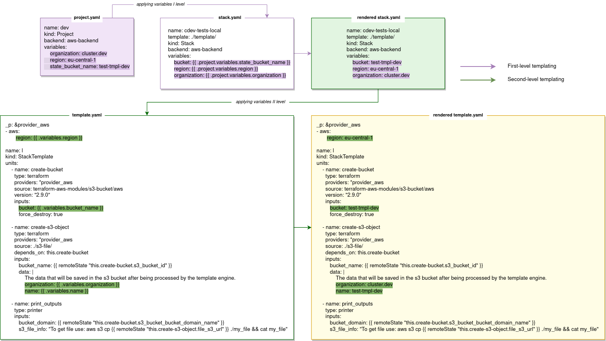

# Templating

## Levels of templating

Cluster.dev has a two-level templating that is applied on the project's and on the stack template's levels.



On the first level Cluster.dev reads a `project.yaml` and files with secrets. Then it uses [variables](#variables) from these files to populate and render files from the current project – stacks and backends.

On the second level data from the stack object (an outcome of the first stage) is used to render stack template files.

The templating process could be described as follows:

1.	Reading data from `project.yaml` and secrets.

2.	Using the data to render all `yaml` files within the project directory.

3.	Reading data from `stack.yaml` and `backend.yaml` (the files rendered in p.#2) – **first-level templating**.

4.	Downloading specified stack templates.

5.	Rendering the stack templates from data contained in the corresponding `stack.yaml` files (p.#3) – **second-level templating**.

6.	Reading units from the stack templates.

7.	Executing the project.

## Variables

### Global and stack-specific variables

The variables stored and defined within a project are global. They could be common for a few stacks that are reconciled within a project, and passed across them. Example of `project.yaml`:

```yaml
name: my_project
kind: project
backend: aws-backend
variables:
  organization: shalb
  region: eu-central-1
  state_bucket_name: cdev-states
exports:
  AWS_PROFILE: cluster-dev
```

Global variables can’t be used in stack templates directly. From `project.yaml` the variable value is passed to `stack.yaml` from where it is applied to a stack template.

Stack-specific variables are defined within a stack and relate to a concrete infrastructure. They can be used solely in the stack templates that are bound to this stack.

### Variables reference

Global variables could be used in all configurations of stacks and backends within a given project.

To refer to a global variable, use the {{ .project.variables.KEY_NAME }} syntax, where `.project.variables` is the path that follows the structure of variables in a `project.yaml`:

```yaml
name: demo
kind: Project
variables:
  region: eu-central-1
```

The KEY_NAME stands for the variable name defined in the `project.yaml` and will be replaced by its value. Example of global variables reference in a `stack.yaml`:

```yaml
name: eks-demo
template: https://github.com/shalb/cdev-aws-eks?ref=v0.2.0
kind: Stack
backend: aws-backend
variables:
  region: {{ .project.variables.region }}
  organization: {{ .project.variables.organization }}
  domain: cluster.dev
  instance_type: "t3.medium"
  eks_version: "1.20"
```

The same syntax applies to the secrets' data: {{ .secrets.secret_name.secret_key }}. Let’s assume we have a secret in AWS Secrets Manager:

```yaml
name: my-aws-secret
kind: Secret
driver: aws_secretmanager
spec: 
    region: eu-central-1
    aws_secret_name: pass
```

In order to refer to the secret in stack files, we need to define it as {{ .secrets.my-aws-secret.some-key }}.
