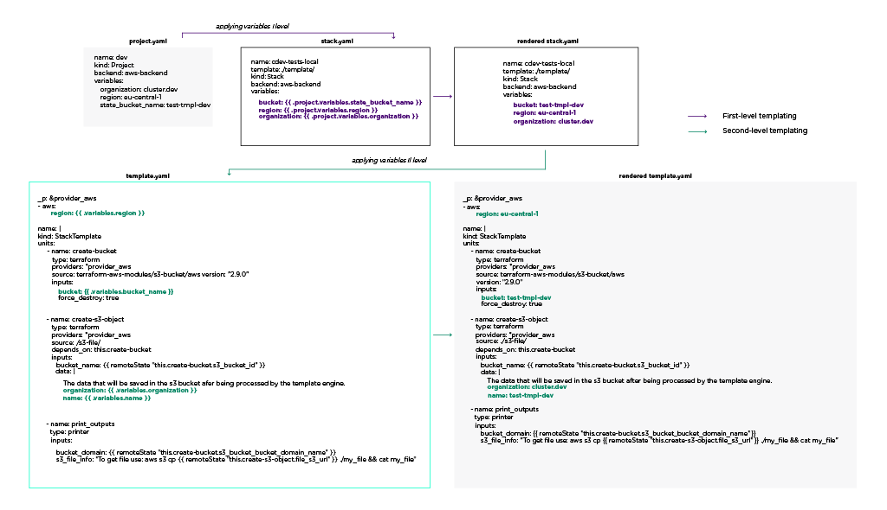

# Templating

## Levels of templating

Cluster.dev has a two-level templating that is applied on the project's and on the stack template's levels.

On the first level Cluster.dev reads a `project.yaml` and files with secrets. Then it uses variables from these files to populate and render files from the current project – stacks and backends.

On the second level data from the stack object (an outcome of the first stage) is used to render stack template files.

The templating process could be described as follows:

1.	Reading data from `project.yaml` and secrets.

2.	Using the data to render all `yaml` files within the project directory.

3.	Reading data from `stack.yaml` and `backend.yaml` (the files rendered in p.#2) – **first-level templating**.

4.	Downloading specified stack templates.

5.	Rendering the stack templates from data contained in the corresponding `stack.yaml` files (p.#3) – **second-level templating**.

6.	Reading units from the stack templates.

7.	Executing the project.

