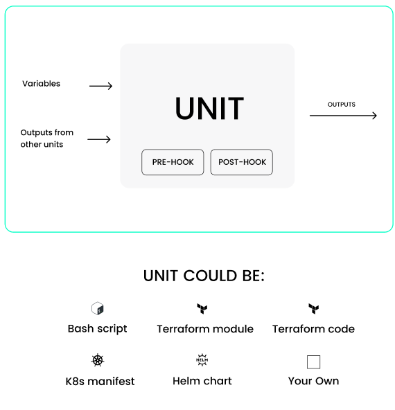

# Overview



## Description

Units are building blocks that stack templates are made of. It could be anything — a Terraform module, Helm you want to install or a Bash script that you want to run. Units can be remote or stored in the same repo with other Cluster.dev code. Units may contain reference to other files that are required for work. These files should be located inside the current directory (within the stack template's context). As some of the files will also be rendered with the project's data, you can use Go templates in them.

All units described below have a common format and common fields. Base example:

```yaml
  - name: k3s
    type: tfmodule
    depends_on:
      - this.unit1_name
      - this.unit2_name
#   depends_on: this.unit1_name # is allowed to use string for single, or list for multiple dependencies
    pre_hook:
      command: "echo pre_hook"
      # script: "./scripts/hook.sh"
      on_apply: true
      on_destroy: false
      on_plan: false
    post_hook:
      # command: "echo post_hook"
      script: "./scripts/hook.sh"
      on_apply: true
      on_destroy: false
      on_plan: false
```

* `name` - unit name. *Required*.

* `type` - unit type. One of: `shell`, `tfmodule`, `helm`, `kubernetes`, `printer`.

* `depends_on` - *string* or *list of strings*. One or multiple unit dependencies in the format "stack_name.unit_name". Since the name of the stack is unknown inside the stack template, you can use "this" instead:`"this.unit_name.output_name"`.

* `pre_hook` and `post_hook` blocks: describe the shell commands to be executed before and after the unit, respectively. The commands will be executed in the same context as the actions of the unit. Environment variables are common to the shell commands, the pre_hook and post_hook scripts, and the unit execution. You can export a variable in the pre_hook and it will be available in the post_hook or in the unit.

    * `command` - *string*. Shell command in text format. Will be executed in Bash -c "command". Can be used if the "script" option is not used. One of `command` or `script` is required.

    * `script` - *string*. Path to shell script file which is relative to template directory. Can be used if the "command" option is not used. One of `command` or `script` is required.

    * `on_apply` *bool*, *optional*. Turn off/on when unit applying. **Default: "true"**.

    * `on_destroy` - *bool*, *optional*. Turn off/on when unit destroying. **Default: "false"**.

    * `on_plan` - *bool*, *optional*. Turn off/on when unit plan executing. **Default: "false"**.
